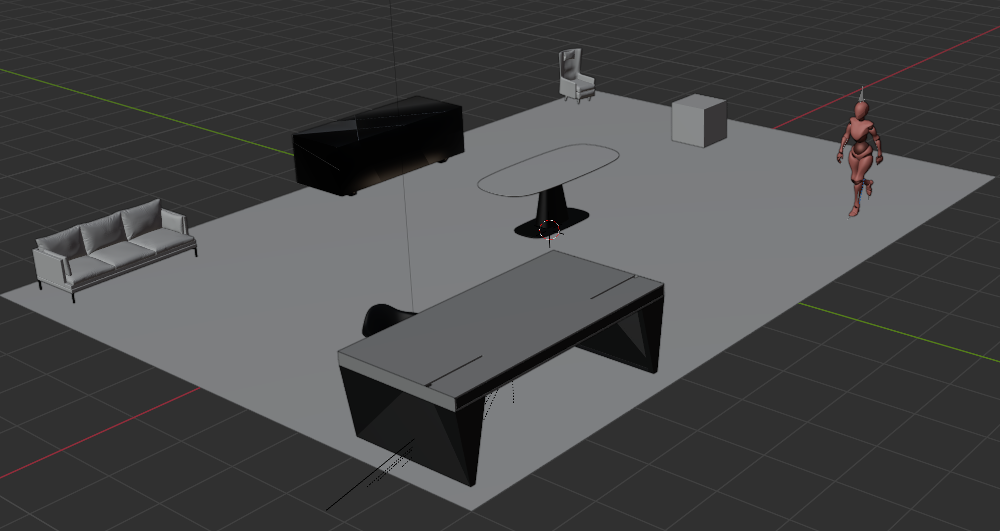
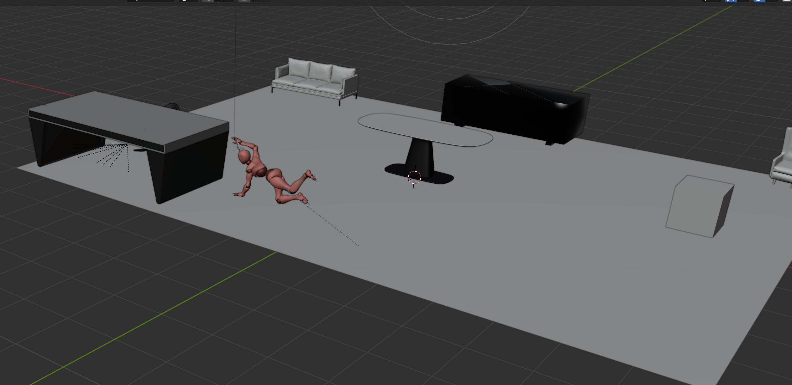
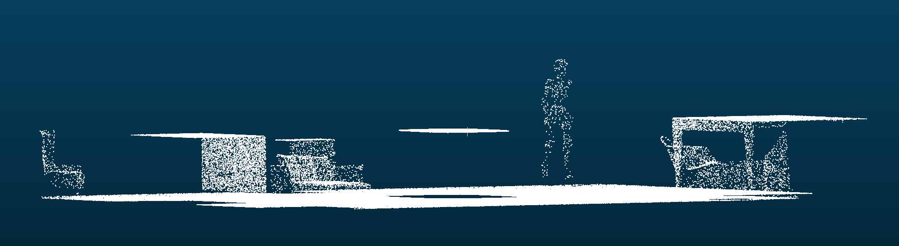
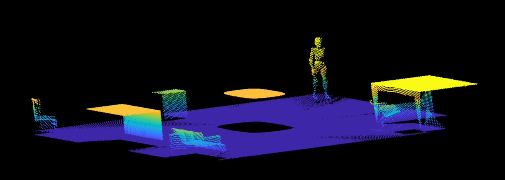
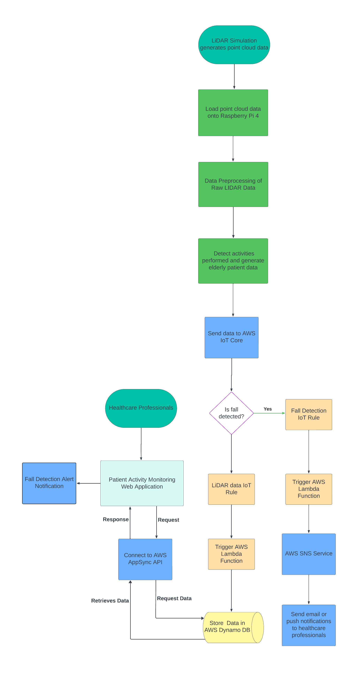
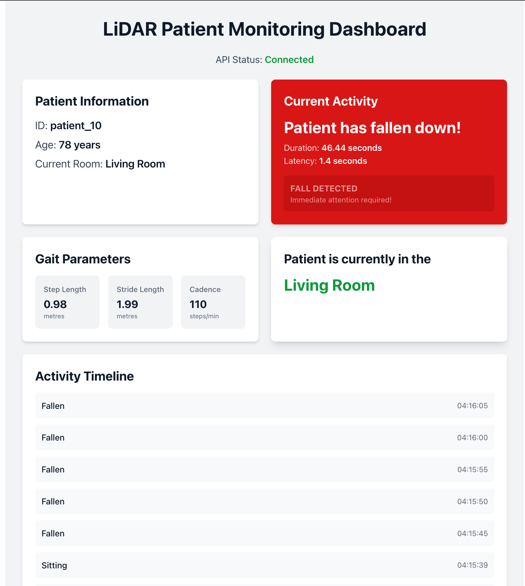

# 3D LiDAR Activity Recognition and Fall Detection System for Enhancement of Elderly Care

## Abstract
The elderly population has been rapidly rising in the recent years, placing extra demand on
healthcare facilities like hospitals and aged care facilities. This rising demographic has also
placed a lot of pressure on healthcare professionals like doctors, nurses and carers due to a
critical shortage of staff. Therefore, round the clock monitoring of vulnerable elderly patients
susceptible to falls and gait disorders, proves to be immensely difficult. Often random falls of
elderly patients go unnoticed for many minutes or even hours. When the patient is discovered,
irreversible damage to their body and health would have already occurred. This paper proposes
a novel IoT-enabled LiDAR framework designed for real-time detection of anomalies in the
Activities of Daily Living (ADL’s) of Elderly Patients, falls and gait disorders. The framework
consists of four main components such as 3D LiDAR blender simulation, edge computing layer,
cloud computing layer and a patient activity monitoring web application. Algorithms for the
generation of simulated LiDAR data and data processing have been presented. The Raspberry
Pi 4 has been employed as the edge device along with Amazon Web Services for the cloud
computing layer. The IoT-LiDAR system has been tested for real-time performance. The results
data processing speed of the edge device is found to be 125ms and the end-to-end system
latency is 1.6 seconds. These results highlight the capability of the system to enable healthcare
professionals to rapidly respond to emergency situations and provide quality care to elderly
patients. This research thesis contributes to the field of healthcare by offering a non-obtrusive
privacy preserving solution to elderly patient activity monitoring in indoor environments. 

## Proposed Solution and High-Level System Architecture

## Novel 3D LiDAR Simulation using Blender

For the implementation of our IoT-LiDAR detection system, we required access to detailed
point cloud data ideally through data acquisition from a physical 3D LiDAR sensor installed
in an indoor environment and monitoring elderly participants. However, since we are aiming to
implement a proof of concept (PoC) demonstration of the IoT-LiDAR system, the above ideal
experimental setup would be too complex and unachievable with our given time constraints.
There was also the challenge of acquiring a 3D LiDAR sensor for research purposes, which
exceeded the projects budget and had very long shipping times. Also, at the time of conducting
this research, to our knowledge, there are no publicly available 3D LiDAR point cloud
datasets, that have specifically captured data of individuals performing Activities of Daily
Living (ADL’s), either in outdoor and indoor environments. Therefore, there was a significant
challenge of being able to collect 3D LiDAR point cloud data of humans performing activities,
without a physical LiDAR sensor and elderly participants. To solve this problem, we developed
a novel 3D LiDAR Simulation using Blender. The advantages of using a LiDAR simulation
to develop a proof-of-concept IoT-LiDAR system are numerous. The key advantages are
highlighted below:
1. Extremely Cost-Effective Solution: For developing the 3D LiDAR simulation, we use
Blender which is a free open-source 3D computer graphics and animation tool. The only
requirement to use this software is to have a Windows or Mac machine, which means
no expensive LiDAR hardware and real-world physical space is required and therefore
significantly reducing the effective cost of the project.
2. Significant Time Saving: To set up a physical indoor environment with furniture and
installation of 3D LiDAR hardware requires substantial amounts of time and planning.
In comparison, using a LiDAR simulation saves significant amount of time and can
easily be used for rapid prototyping and testing of the IoT-LiDAR system. The LiDAR
simulation can be used at any time during the day, whereas using a real-world indoor
environment would require permissions to access only at specific times and meet
scheduling requirements.
3. Eliminated Safety Concerns and is Ethical: In real-world experimental set up, we
would require having participants perform daily activities and carefully replicating falls
in the indoor environment. This raises ethical and safety concerns, which would require
collaboration with healthcare and legal professionals, to always ensure a safe environment
for the participants. By using a 3D LiDAR simulation, we have reduced the safety and
ethical concerns to zero, since no human participants is required nor harmed from the
simulation. The experiment is entirely run virtually on the computer.
4. Privacy Preserving Solution: The 3D LiDAR simulation is 100% privacy preserving,
where no personal or sensitive information about any individual is collected and stored.
5. Highly Scalable: The 3D LiDAR simulation is highly scalable, which means we can
create many simulations with indoor environments of varying dimensions and include
variety of furniture layouts to simulate real-world room variations. We can also animate
human models in Blender to perform various activities, and run the simulation as many
times as required to get high quality data to train deep learning models.

*Blender LiDAR simulation of human model walking in indoor environment*

*Blender LiDAR simulation of human model falling in indoor environment*

## Generation of Rays and Point Cloud Data
Most modern 3D LiDAR sensors work by emitting pulses of light and perform scanning in a
radial pattern having 360 degrees horizontal field of view and 90 degrees vertical field of view.
Therefore, in the GenerateRays function in our proposed algorithm, we employ the spherical coordinate
system, and numpy’s random uniform sampling method to create a set of rays travelling in
different directions. Two arrays are created for this. The first array includes random uniformly
distributed numbers from 0 to 2pi, representing the azimuthal angle theta(𝜃). This creates an
array of horizontal values ranging from 0 to 360 degrees. Similarly, the second array includes
numbers ranging from 0 to pi representing the zenith angle phi(𝜙). This creates an array of
vertical values ranging from 0 to 180 degrees. We then convert the spherical coordinates into
its corresponding cartesian coordinates, which is then returned by the function.

*Point Cloud Data generated by the LiDAR simulation*

*Visualisation of Point Cloud Data using MATLAB*

## Data Flow of the IoT-LiDAR System

  

## Fall Detection Notification System

The most important feature of the patient monitoring web application is its ability to provide
real-time notifications to healthcare professionals. This is achieved using the dynamic rendering
of components using ReactJS. When the Raspberry Pi edge device has detected a fall, the current
activity card in the web application turns bright red and starts blinking, which can be seen in
the screenshot below. This would bring immediate attention to any healthcare professional using the web
application, and will trigger an immediate response to provide emergency care to their elderly
patient.

  
  
<em>Patient Activity Monitoring Web App UI Notification when a Fall is Detected</em>

## Real-Time Perfromance of the IoT-LiDAR System

To deploy an IoT-LiDAR detection system into the real-world, one of the most crucial
factors enabling its success would be the systems real-time performance. In our proof-ofconcept
design, we have tested the real-time capabilities of the Raspberry Pi 4, in processing
the point cloud data along with testing the end-to-end latency of the whole system. During
testing, we have determined that the average time taken for the Raspberry pi to apply all the
data pre-processing steps to one point cloud data file is 125ms. This result is very promising,
as shows the capability of the Raspberry Pi 4, to be an effective edge device for an IoT-LiDAR
system. This result shows that the Raspberry Pi 4, can be delegated the task of specifically
only performing data preprocessing of the point cloud data. Special devices such as Google
Coral USB accelerator specifically designed for deep learning model inference, could then be
integrated with the Raspberry Pi and used to deploy pre-trained deep learning models. It is
also important to note that the Raspberry Pi 4, is an older model. With the recent release of
the Raspberry Pi 5, which is claimed to be 3 to 4 times faster than the Raspberry Pi 4, we can
expect the real-time performance of our IoT-LiDAR system to improve significantly. The endto-
end system latency has also been tested. This is the time taken for the IoT-LiDAR system to
complete the data pre-processing of the point cloud data, simulate deep learning inference, send
patient activity data to AWS services, and then be displayed by the patient activity monitoring
web application. In our testing, we have found that the end-to-end latency to be 1.6 seconds
on average. This result shows that, when the system detects that a fall event has occurred
(simulated), it takes less that 2 seconds for the fall detection notification to appear in the frontend
web application. Having a response time of less than two seconds is extremely promising.
This aids healthcare professionals to provide an emergency response within two seconds of
the fall occurring. During future research, into deep learning model training, optimisation,
deployment and investing in more capable edge device hardware, we hope to achieve a similar
or even better results.

